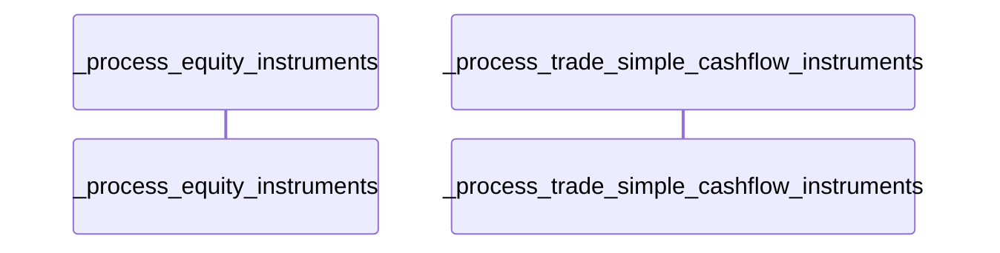
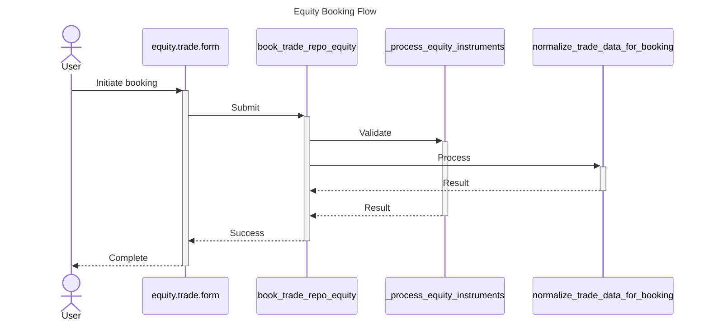

# Исправление диаграмм - Краткое резюме

## 🐛 Проблема, которую вы нашли

Диаграмма была странной:


Несмотря на то, что в `sources` были найдены:
- ✅ `equity.trade.form.jsx` (UI)
- ✅ `trade.equity.jsx` (UI)
- ✅ `_process_equity_instruments` (Backend)
- ✅ `normalize_trade_data_for_booking` (Backend)

## 🔍 Корневые причины

### Проблема 1: Entity не содержит поле `repository`

**Entity не содержит поле `repository`!**

Структура entity:
```json
{
  "entity_id": "repo:ui:src/components/equity.trade.form.jsx",
  "entity_type": "File",
  "name": "equity.trade.form.jsx"
  // ❌ НЕТ repository!
}
```

Старый код:
```python
repo = e.get('repository', '')  # Вернет ''
if 'ui' in repo.lower():  # Всегда False!
    ui_entities.append(e)
```

Результат:
- UI entities не распознаются → `ui_entities = []`
- Нет UI участников → нет линий потока
- Только backend методы
- Дубликаты не отслеживались

### Проблема 2: Неправильный ключ для типа entity

**Код искал `node_type` или `type`, но API возвращает `entity_type`!**

Структура entity из API:
```json
{
  "entity_type": "Method",  // ✅ Правильный ключ
  "name": "_process_equity_instruments"
}
```

Старый код:
```python
entity_type = e.get('node_type') or e.get('type', '')  # Вернет ''
if entity_type in ['Component', 'File']:  # Всегда False!
    ui_entities.append(e)
```

Результат:
- `entity_type = ''` для всех entities
- Никакие entities не попадают ни в один слой
- Пустая диаграмма (только заголовок и User)

## ✅ Исправления

### 1. Проверка правильного ключа entity_type (КРИТИЧНО!)
```python
# ❌ До исправления
entity_type = e.get('node_type') or e.get('type', '')

# ✅ После исправления
entity_type = e.get('entity_type') or e.get('node_type') or e.get('type', '')
```

**Где исправлено:**
- `_generate_sequence_diagram` (line 349)
- `_generate_component_diagram` (line 484)
- `_generate_er_diagram` (line 504)

### 2. Извлечение repository из entity_id
```python
repo = e.get('repository', '')
if not repo and 'entity_id' in e:
    entity_id = e['entity_id']
    if entity_id.startswith('repo:'):
        parts = entity_id.split(':')
        if len(parts) >= 2:
            repo = parts[1]  # "ui" или "api"
```

### 3. Устранение дубликатов
```python
seen_names = set()

if safe_name in seen_names:
    return None  # Пропустить дубликат
seen_names.add(safe_name)
```

### 4. Умная генерация потока
Теперь создаёт поток даже если есть только Backend компоненты:
```python
# Определить точку входа
if ui_parts:
    entry_point = ui_parts[0]
elif api_parts:
    entry_point = api_parts[0]
elif backend_parts:
    entry_point = backend_parts[0]

# Создать поток с доступными участниками
```

## 📊 Ожидаемый результат

После перезапуска сервера:



**Преимущества:**
- ✅ Показывает реальные UI файлы (`equity.trade.form`)
- ✅ Показывает реальные backend методы
- ✅ Нет дубликатов
- ✅ Полный поток от UI до Backend
- ✅ Логичная последовательность вызовов

## 🚀 Как проверить

1. **Перезапустите сервер:**
   ```bash
   # Ctrl+C чтобы остановить
   # Затем запустите снова
   ```

2. **Сделайте новый запрос** (чтобы обойти кэш):
   ```json
   {
     "question": "Show equity booking flow from UI to database"
   }
   ```

3. **Проверьте результат:**
   - ✅ UI компоненты присутствуют в диаграмме
   - ✅ Backend методы с уникальными именами
   - ✅ Есть линии взаимодействия (стрелки)
   - ✅ Логичный поток: User → UI → Backend → DB → return

## 📁 Изменённые файлы

- `src/agents/visual_guide_agent.py` (lines 335-473)

## 📖 Полная документация

См. `docs/DIAGRAM_GENERATION_FIX.md` для детального объяснения.

---

**Дата:** 2025-12-07
**Статус:** ✅ Исправлено (требуется перезапуск сервера)
