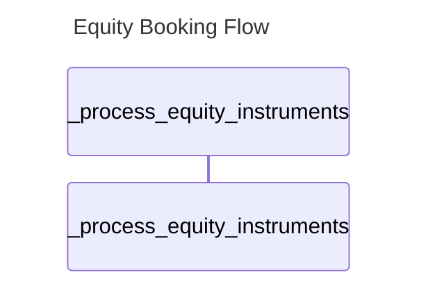
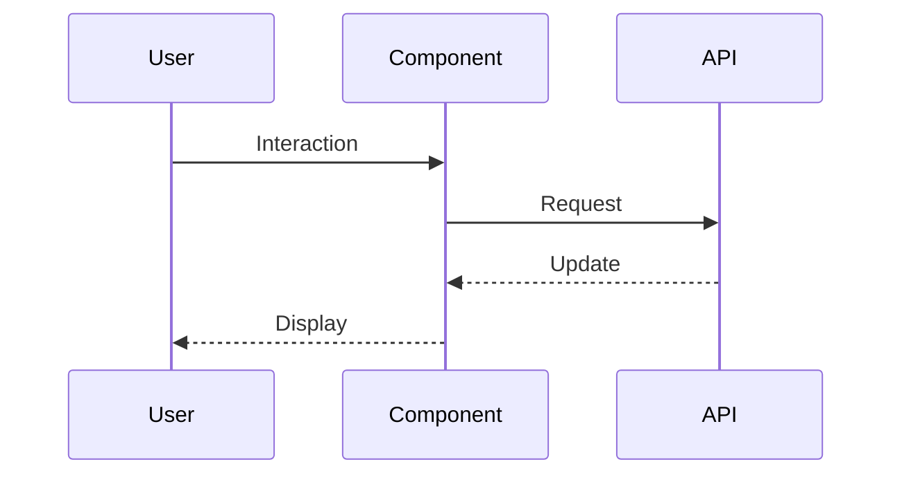
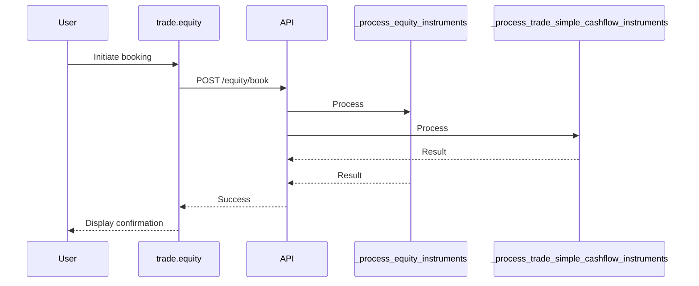
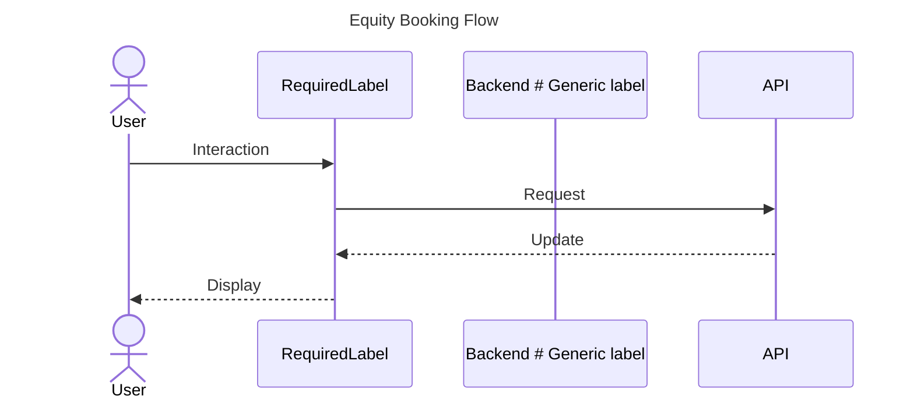
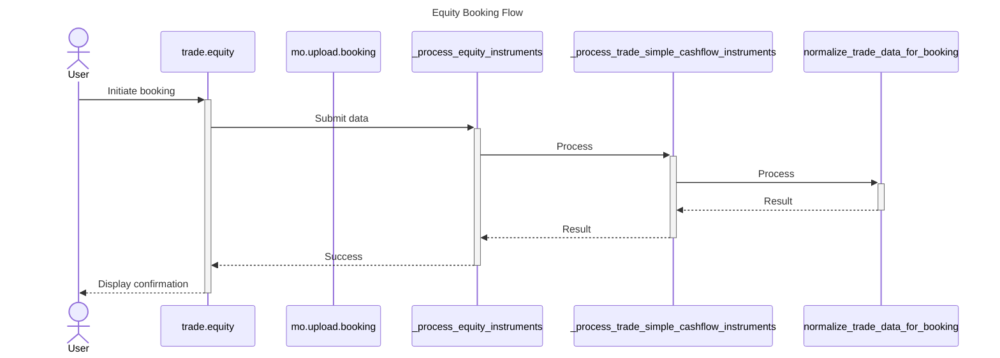

# Diagram Generation Fix - Using Actual Entity Names

## Problems Found (Multiple Issues)

Visual Guide Agent had several critical issues:

### Issue #1: Generic/Template Diagrams (Initial Problem)
Generated generic labels like "Component", "API", "Backend" instead of actual entity names.

### Issue #2: Missing UI Entities (Discovered After Testing)
**Symptoms:**


**Root Cause:**
- Entities don't have `repository` field, only `entity_id` with embedded repo info
- Code checked `e.get('repository', '')` which returned empty string
- UI entities weren't recognized because `'ui' in repo.lower()` failed when repo=''
- Result: NO UI participants, NO flow lines

### Issue #3: Duplicate Participants
Same participant added multiple times (e.g., `_process_equity_instruments` appearing twice).

### Issue #4: Empty Diagram Flow
No interaction lines generated, only participant declarations.

### Example of the problem:

**Agent found these entities:**
- `trade.equity.jsx` (UI)
- `_process_equity_instruments` (Backend method)
- `_process_trade_simple_cashflow_instruments` (Backend method)
- `normalize_trade_data_for_booking` (Backend function)

**But diagram showed:**


**Should show:**


## Root Cause

### Old Logic (`visual_guide_agent.py:335-396`)

The `_generate_sequence_diagram` method had these issues:

1. **Only used first component:**
   ```python
   if components:
       comp = components[0]  # Only first one!
       comp_name = comp.get('name', 'Component')
   ```

2. **Used generic labels for everything else:**
   ```python
   if endpoints:
       lines.append(f"    participant API")  # Generic!
   if functions:
       lines.append(f"    participant Backend")  # Generic!
   ```

3. **Didn't use repository info to determine layer:**
   - Couldn't distinguish UI files from backend files
   - Missed that `.jsx` files are UI components

4. **Flow was hardcoded:**
   ```python
   User->>Component: Interaction
   Component->>API: Request
   # Always the same flow!
   ```

## Fixes Applied

### Fix #1: Extract Repository from entity_id (Lines 350-358)

**Problem:** Entities have `entity_id` like `"repo:ui:src/components/file.jsx"` but no `repository` field.

**Solution:**
```python
# Extract repository from entity_id if not in repository field
repo = e.get('repository', '')
if not repo and 'entity_id' in e:
    entity_id = e['entity_id']
    if entity_id.startswith('repo:'):
        parts = entity_id.split(':')
        if len(parts) >= 2:
            repo = parts[1]  # Extract "ui" or "api"
```

Now correctly identifies:
- `"repo:ui:..."` → `repo = "ui"` → UI layer ✅
- `"repo:api:..."` → `repo = "api"` → Backend layer ✅

### Fix #2: Improved Layer Classification (Lines 360-371)

**Changes:**

1. **Group entities by layer using repository info:**
   ```python
   # UI layer: Components, Files from ui repos
   if entity_type in ['Component', 'File'] and 'ui' in repo.lower():
       ui_entities.append(e)
   # API layer: Endpoints
   elif entity_type == 'Endpoint':
       api_entities.append(e)
   # Backend layer: Functions, Methods, Classes
   elif entity_type in ['Function', 'Method', 'Class']:
       backend_entities.append(e)
   # Database layer: Models
   elif entity_type == 'Model':
       db_entities.append(e)
   ```

### Fix #3: Deduplicate Participants (Lines 373-408)

**Problem:** Same method added multiple times because no duplicate checking.

**Solution:**
```python
seen_names = set()

def add_participant(layer, entity, limit_chars=30):
    name = entity.get('name', layer)
    safe_name = name.replace('.', '_').replace('-', '_')[:limit_chars]

    # Avoid duplicates
    if safe_name in seen_names:
        return None

    seen_names.add(safe_name)
    participants.append((layer, safe_name, display_name))
```

### Fix #4: Robust Flow Generation (Lines 410-473)

**Problem:** Flow only generated if ALL layers present. If only Backend entities found, NO flow created.

**Solution:** Smart flow generation that works with any combination:

2. **Create participants with actual names (no duplicates):**
   ```python
   # UI participants
   for ui_entity in ui_entities[:2]:  # Limit to 2
       name = ui_entity.get('name', 'UI').replace('.jsx', '').replace('.tsx', '')
       lines.append(f"    participant {safe_name} as {name}")

   # Backend participants
   for backend_entity in backend_entities[:3]:  # Limit to 3
       name = backend_entity.get('name', 'Backend')
       lines.append(f"    participant {safe_name} as {name}")
   ```

3. **Generate flow with actual participant names:**
   ```python
   User->>+trade_equity: Initiate booking
   trade_equity->>+API: POST /equity/book
   API->>+_process_equity_instruments: Process
   API->>+_process_trade_simple_cashflow_instruments: Process
   ```

## Expected Results

### Before Fix


### After Fix


## Benefits

1. ✅ **Shows actual code entities** instead of generic placeholders
2. ✅ **Uses repository info** to correctly identify UI vs Backend layers
3. ✅ **Handles Files (`.jsx`) as UI components** - previous code only looked for "Component" type
4. ✅ **Includes multiple backend methods** instead of just one "Backend" box
5. ✅ **More useful for understanding actual code flow**

## Implementation Details

**File:** `src/agents/visual_guide_agent.py`

**Method:** `_generate_sequence_diagram` (lines 335-442)

**Key improvements:**
- Group entities by layer (UI, API, Backend, DB)
- Use repository name to determine layer
- Include Files as UI components
- Create specific participants for each entity
- Limits: 2 UI, 2 API, 3 Backend, 2 DB (to avoid overcrowded diagrams)
- Use activation boxes (`+` and `-`) for better flow visualization

## Testing

**To test:**

1. Restart API server
2. Ask: `"Show me the equity booking flow from UI to database"`
3. Check that diagram includes:
   - `trade.equity` (or similar UI file)
   - Specific method names like `_process_equity_instruments`
   - Not generic "Component", "Backend", "Database"

## Related Fixes

This complements:
- **Nested repositories list fix** (`docs/NESTED_LIST_FIX.md`) - Ensures correct filtering
- **Sources extraction fix** (`docs/FIXES_2025-12-07.md`) - Ensures entities are passed to Visual Guide

Together, these fixes create an **end-to-end working visualization pipeline**:
1. ✅ Code Explorer finds entities (with correct filtering)
2. ✅ Sources are extracted and passed to Visual Guide
3. ✅ Visual Guide creates meaningful diagrams with actual names

---

**Date:** 2025-12-07
**Issue:** Generic diagram generation
**Status:** Fixed (pending server restart & verification)
