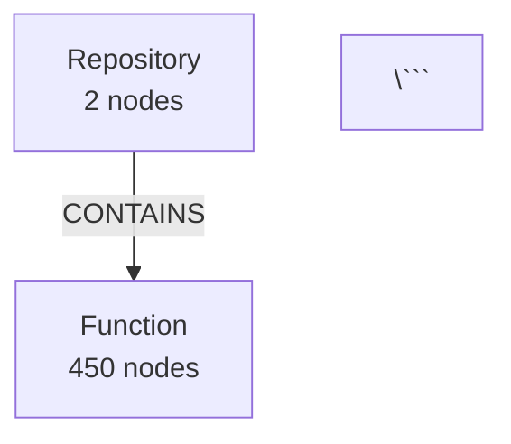

# Graph Visualization API

Новые эндпоинты для визуализации структуры графовой БД Neo4j и результатов поиска.

## Endpoints

### 1. GET /api/graph-schema - Схема графовой БД

Визуализирует полную схему Neo4j: все типы нод, связи между ними и количество элементов.

**Параметры:**
- `format` (опционально): "mermaid" или "url" (по умолчанию "mermaid")

**Примеры:**

```bash
# Получить Mermaid код
curl "http://localhost:8000/api/graph-schema?format=mermaid"

# Получить URL на готовую картинку
curl "http://localhost:8000/api/graph-schema?format=url"
```

**Ответ (format=url):**
```json
{
  "mermaid_code": "graph TB\n  Repository[\"**Repository**<br/>2 nodes\"]...",
  "diagram_url": "https://mermaid.ink/img/...",
  "node_types": 8,
  "relationship_types": 12,
  "total_nodes": 1523,
  "total_relationships": 3456
}
```

**Что показывает:**
- 📦 **Repository** (синий) - репозитории
- 🔧 **Function/Method/Class** (фиолетовый) - код
- 🎨 **Component/File** (зеленый) - UI компоненты
- 🌐 **Endpoint** (оранжевый) - API эндпоинты
- 💾 **Model** (розовый) - модели данных

---

### 2. GET /api/search-graph - Граф результатов поиска

Показывает найденные ноды и связи между ними для указанного запроса.

**Параметры:**
- `query` (обязательный): поисковый запрос
- `limit` (опционально): максимальное количество нод (1-20, по умолчанию 10)
- `format` (опционально): "mermaid" или "url" (по умолчанию "url")

**Примеры:**

```bash
# Найти ноды связанные с "equity trade"
curl "http://localhost:8000/api/search-graph?query=equity%20trade&limit=15&format=url"

# Найти ноды связанные с "authentication"
curl "http://localhost:8000/api/search-graph?query=auth&limit=10&format=url"
```

**Ответ:**
```json
{
  "query": "equity trade",
  "nodes_found": 12,
  "relationships_found": 8,
  "mermaid_code": "graph LR\n  N0[\"book_trade_equity<br/><small>Function</small>\"]...",
  "diagram_url": "https://mermaid.ink/img/..."
}
```

**Что показывает:**
- Все ноды, содержащие query в имени или ID
- Связи между найденными нодами
- Тип каждой ноды (цветовое кодирование)

---

### 3. GET /api/repository-structure - Структура репозитория

Показывает иерархическую структуру репозитория: файлы, классы, функции.

**Параметры:**
- `repository` (обязательный): имя репозитория (например, "ui", "api")
- `max_depth` (опционально): максимальная глубина обхода (1-4, по умолчанию 2)
- `format` (опционально): "mermaid" или "url" (по умолчанию "url")

**Примеры:**

```bash
# Структура API репозитория
curl "http://localhost:8000/api/repository-structure?repository=api&max_depth=2&format=url"

# Структура UI репозитория
curl "http://localhost:8000/api/repository-structure?repository=ui&max_depth=3&format=url"
```

**Ответ:**
```json
{
  "repository": "api",
  "nodes_shown": 45,
  "mermaid_code": "graph TD\n  REPO[\"api<br/><small>Repository</small>\"]...",
  "diagram_url": "https://mermaid.ink/img/..."
}
```

**Что показывает:**
- Дерево файлов репозитория
- Классы и функции внутри файлов
- Методы внутри классов
- Иерархия CONTAINS связей

---

## Использование в приложении

### Пример 1: Просмотр полной схемы БД

```python
import requests

response = requests.get(
    "http://localhost:8000/api/graph-schema",
    params={"format": "url"},
    headers={"X-API-Key": "your-api-key"}
)

data = response.json()
print(f"Схема графа: {data['diagram_url']}")
print(f"Всего типов нод: {data['node_types']}")
print(f"Всего нод: {data['total_nodes']}")
```

### Пример 2: Визуализация результатов поиска

```python
import requests

response = requests.get(
    "http://localhost:8000/api/search-graph",
    params={
        "query": "equity trade",
        "limit": 15,
        "format": "url"
    },
    headers={"X-API-Key": "your-api-key"}
)

data = response.json()
print(f"Найдено нод: {data['nodes_found']}")
print(f"Найдено связей: {data['relationships_found']}")
print(f"Диаграмма: {data['diagram_url']}")
```

### Пример 3: Исследование структуры репозитория

```python
import requests

response = requests.get(
    "http://localhost:8000/api/repository-structure",
    params={
        "repository": "api",
        "max_depth": 2,
        "format": "url"
    },
    headers={"X-API-Key": "your-api-key"}
)

data = response.json()
print(f"Репозиторий: {data['repository']}")
print(f"Показано нод: {data['nodes_shown']}")
print(f"Структура: {data['diagram_url']}")
```

---

## Mermaid диаграммы

Все эндпоинты возвращают Mermaid код, который можно:

1. **Встроить в Markdown:**
```markdown


2. **Рендерить в HTML:**
```html
<script src="https://cdn.jsdelivr.net/npm/mermaid/dist/mermaid.min.js"></script>
<div class="mermaid">
graph TD
  Repository["Repository<br/>2 nodes"]
</div>
```

3. **Использовать готовую картинку (format=url):**
```markdown

```

---

## Цветовое кодирование

Типы нод окрашены для лучшей читаемости:

- 🔵 **Repository** - светло-голубой (#e1f5ff)
- 🟣 **Function/Method/Class** - фиолетовый (#f3e5f5)
- 🟢 **Component/File** - зеленый (#e8f5e9)
- 🟠 **Endpoint** - оранжевый (#fff3e0)
- 🔴 **Model** - розовый (#fce4ec)
- 🔷 **Class** - синий (#e3f2fd)

---

## Советы по использованию

### Отладка поиска
Используйте `/api/search-graph` для визуализации найденных нод и понимания, как они связаны.

```bash
# Посмотреть что нашлось по запросу
curl "http://localhost:8000/api/search-graph?query=book_trade&format=url"
```

### Исследование новой кодовой базы
Начните с `/api/graph-schema` чтобы понять общую структуру, затем используйте `/api/repository-structure` для детального изучения.

```bash
# Общая схема
curl "http://localhost:8000/api/graph-schema?format=url"

# Детали репозитория
curl "http://localhost:8000/api/repository-structure?repository=api&format=url"
```

### Документирование архитектуры
Сохраняйте Mermaid код в документацию:

```bash
# Получить Mermaid код для документации
curl "http://localhost:8000/api/graph-schema?format=mermaid" > docs/graph-schema.mmd
```

---

## Ограничения

- `/api/search-graph`: максимум 20 нод (параметр limit)
- `/api/repository-structure`: максимум 100 путей, 50 нод на диаграмме
- `/api/graph-schema`: максимум 50 типов связей

Эти лимиты предотвращают создание слишком больших диаграмм, которые сложно читать.
